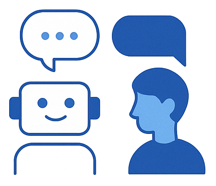

  

# Implement an agentic solution (5–10%)

This section covers the creation, configuration, and deployment of AI agents using Azure services and frameworks like Semantic Kernel or Autogen.

## Skills & Microsoft Learn Resources

### Create custom agents

*Focuses on the design, development, configuration, and deployment of AI agents capable of performing complex, multi-step tasks.*

| Skill / Focus Area | Description / Context | Resources |
| :------------------------------------------------------------------------ | :---------------------------------------------------------------------------------------------------------------------------------------------------------------------------------------- | :----------------------------------------------------------------------------------------------------------------------------------------------------------------------------------------------------------------------------------------------------------------------------------------------------------------------------------------------------------------------------------------------------------------------------------------------------------------------------------------------------------------------------------------- |
| **Understand the role and use cases of an agent** | Defining what constitutes an AI agent (perception, reasoning, planning, action), its potential capabilities (tool use, memory, autonomy), and identifying suitable applications. | Learn Module: [Introduction to AI agents](https://learn.microsoft.com/en-us/training/modules/introduction-ai-agents/) |
| **Configure necessary resources to build an agent** | Setting up the required Azure infrastructure, which typically includes an Azure AI Studio project, Azure OpenAI resource (for LLMs), potentially Azure AI Search (for RAG), and compute resources. | Learn Module: [Introduction to AI agents](https://learn.microsoft.com/en-us/training/modules/introduction-ai-agents/) *(Introduces resource concepts)*   *(Specific resource setup depends on the chosen framework and complexity)* |
| **Create an agent with Azure AI capabilities** | Leveraging Azure AI Studio features (like Prompt Flow) or Azure OpenAI capabilities (like the Assistants API) as foundational elements or simpler implementations of agent-like behavior. | Docs: [Azure OpenAI Assistants API](https://learn.microsoft.com/en-us/azure/ai-services/openai/how-to/assistant) *(Example of an agent-like capability)*  Docs: [Prompt flow overview](https://learn.microsoft.com/en-us/azure/ai-studio/concepts/prompt-flow-overview) *(Can orchestrate agent steps)* |
| **Implement complex agents with Semantic Kernel and Autogen** | Utilizing specialized open-source frameworks: **Semantic Kernel** (for integrating LLMs with conventional code, managing prompts, memory, and planning) and **AutoGen** (for creating multi-agent conversational systems). | Docs: [Semantic Kernel Overview](https://learn.microsoft.com/en-us/semantic-kernel/overview/) Docs: [AutoGen Documentation](https://microsoft.github.io/autogen/) *(Note: Deep integration often requires exploring framework-specific documentation, examples, and community resources alongside Azure service integration.)* |
| **Implement complex workflows (multi-agent, orchestration, autonomous)** | Designing sophisticated agent behaviors involving multiple agents collaborating (AutoGen), complex task decomposition and execution planning (Semantic Kernel Planners), or increased levels of autonomy. | *(These advanced concepts are primarily implemented using patterns and features within frameworks like Semantic Kernel (Planners, Functions, Connectors) and AutoGen (Group Chat, Conversable Agents). Refer to their respective documentation and examples.)* |
| **Test, optimize and deploy an agent** | Evaluating agent performance against goals, debugging complex interactions, optimizing prompts/plans/tool usage, and deploying the agent solution (often as a containerized application or web service). | *(Testing/Optimization strategies are evolving. Explore evaluation techniques within Prompt Flow, framework-specific logging/debugging, and standard software deployment practices. Refer to Semantic Kernel and Autogen documentation for framework-specific guidance.)*   Docs: [Monitor and collect feedback on prompt flows](https://learn.microsoft.com/en-us/azure/ai-studio/how-to/monitor-prompt-flow) *(Example for flow-based components)* |
