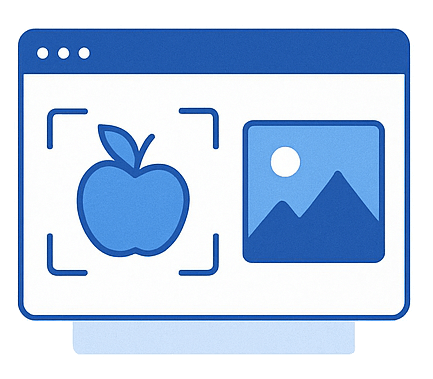

  

# Implement computer vision solutions (10–15%)

This section focuses on analyzing images and videos using Azure AI Vision, including pre-built and custom models.

## Skills & Microsoft Learn Resources

### Analyze images (Using Azure AI Vision)

*Leveraging the pre-trained capabilities of the Azure AI Vision service to extract a wide range of insights from images without needing custom model training.*

| Skill / Focus Area | Description / Context | Resources |
| :------------------------------------------------------- | :----------------------------------------------------------------------------------------------------------------------------------------------- | :------------------------------------------------------------------------------------------------------------------------------------------------------------------------------------------------------------------------------------------------------------------------------------------------------------------- |
| **Select visual features for image processing** | Choosing the specific types of analysis to perform on an image (e.g., detecting objects, generating tags, reading text, identifying faces, detecting adult content). | Learn Module (within path): [Analyze images with the Azure AI Vision service](https://learn.microsoft.com/en-us/training/modules/analyze-images-computer-vision/) *(Covers selecting features)* |
| **Detect objects and generate image tags** | Identifying common objects within an image and their bounding boxes (object detection), and generating relevant descriptive keywords/tags (tagging). | Learn Module (within path): [Detect common objects in images](https://learn.microsoft.com/en-us/training/modules/detect-objects-images/) Learn Module (within path): [Analyze images with the Azure AI Vision service](https://learn.microsoft.com/en-us/training/modules/analyze-images-computer-vision/) *(Covers tagging)* |
| **Include features in image processing request** | Specifying the desired types of analysis (visual features) when calling the Azure AI Vision API or using the SDK. | Learn Module (within path): [Analyze images with the Azure AI Vision service](https://learn.microsoft.com/en-us/training/modules/analyze-images-computer-vision/) *(Demonstrates API calls)* |
| **Interpret image processing responses** | Understanding the structured JSON output returned by the service, which contains the results for the requested visual features (e.g., coordinates, confidence scores, text). | Learn Module (within path): [Analyze images with the Azure AI Vision service](https://learn.microsoft.com/en-us/training/modules/analyze-images-computer-vision/) *(Explains response structure)* |
| **Extract text from images (OCR)** | Using Optical Character Recognition (OCR) to read printed text found within an image. | Learn Module (within path): [Read text in images and documents with the Azure AI Vision service](https://learn.microsoft.com/en-us/training/modules/read-text-computer-vision/) |
| **Convert handwritten text using OCR** | Using OCR capabilities specifically tuned to read handwritten text from images. | Learn Module (within path): [Read text in images and documents with the Azure AI Vision service](https://learn.microsoft.com/en-us/training/modules/read-text-computer-vision/) |

______________________________________________________________________

### Implement custom vision models (Using Azure AI Custom Vision)

*Training your own image analysis models when pre-built models are insufficient, focusing on specific classification tasks or detecting unique objects.*

| Skill / Focus Area | Description / Context | Resources |
| :----------------------------------------------------------- | :--------------------------------------------------------------------------------------------------------------------------------------------------------------------------------- | :------------------------------------------------------------------------------------------------------------------------------------------------------------------------------------------------------------------------------------------------------------------------------------------------------------------------------------------------------------------------------------------------------------------------------------------ |
| **Choose between image classification & object detection** | Deciding whether the goal is to assign a single label to an entire image (classification) or identify multiple objects and their locations within an image (object detection). | Learn Module (within path): [Classify images with the Azure AI Custom Vision service](https://learn.microsoft.com/en-us/training/modules/classify-images-custom-vision/) Learn Module (within path): [Detect objects in images with Azure AI Custom Vision](https://learn.microsoft.com/en-us/training/modules/detect-objects-custom-vision/) |
| **Label images** | Annotating your training images: Assigning tags/labels to entire images (for classification) or drawing bounding boxes around specific objects (for object detection). | Learn Module (within path): [Classify images with the Azure AI Custom Vision service](https://learn.microsoft.com/en-us/training/modules/classify-images-custom-vision/) *(Demonstrates classification labeling)* Learn Module (within path): [Detect objects in images with Azure AI Custom Vision](https://learn.microsoft.com/en-us/training/modules/detect-objects-custom-vision/) *(Demonstrates object detection labeling)* |
| **Train a custom image model (classification & detection)** | Uploading labeled images to the Custom Vision service and initiating the training process to build either a custom classification or object detection model. | Learn Module (within path): [Classify images with the Azure AI Custom Vision service](https://learn.microsoft.com/en-us/training/modules/classify-images-custom-vision/) *(Trains classification model)* Learn Module (within path): [Detect objects in images with Azure AI Custom Vision](https://learn.microsoft.com/en-us/training/modules/detect-objects-custom-vision/) *(Trains object detection model)* |
| **Evaluate custom vision model metrics** | Assessing the performance of the trained model using metrics provided by the service (e.g., Precision, Recall, Average Precision (AP), mean Average Precision (mAP)). | *(Evaluation steps and metrics interpretation are covered within the training process in the Learn Modules listed above)* |
| **Publish a custom vision model** | Making a trained and evaluated model iteration available via a prediction endpoint so that applications can send images to it for analysis. | *(Publishing steps are covered within the training/deployment process in the Learn Modules listed above)* |
| **Consume a custom vision model** | Sending new images to the published model's prediction endpoint (using SDK or REST API) and interpreting the returned classification or object detection results. | *(Consumption via prediction endpoint is covered in the Learn Modules listed above)* |
| **Build a custom vision model code first** | Programmatically managing the entire Custom Vision project lifecycle (creating projects, uploading/labeling images, training, publishing, predicting) using the provided SDKs (e.g., Python, C#). | Docs: [Quickstart: Create an object detection project with the Custom Vision SDK](https://learn.microsoft.com/en-us/azure/ai-services/custom-vision-service/quickstarts/object-detection?tabs=visual-studio&pivots=programming-language-csharp) *(Example SDK usage for Object Detection)* *(SDK usage is similar for Classification)* |

______________________________________________________________________

### Analyze videos

*Extracting insights from video files or streams using specialized Azure services.*

| Skill / Focus Area | Description / Context | Resources |
| :------------------------------------------------------------- | :----------------------------------------------------------------------------------------------------------------------------------------------- | :------------------------------------------------------------------------------------------------------------------------------------------------------------------------------------------------- |
| **Use Azure AI Video Indexer for insights** | Uploading videos to the Video Indexer service for comprehensive analysis, including speech transcription, translation, face detection, speaker identification, object tracking, topic inference, and more. | Learn Module (within path): [Analyze video with Azure AI Video Indexer](https://learn.microsoft.com/en-us/training/modules/analyze-video/) |
| **Use Azure AI Vision Spatial Analysis for presence/movement** | Deploying AI Vision container skills on edge devices with cameras to analyze real-time video streams for detecting human presence, counting people, and monitoring movement within physical spaces. | Docs: [Overview of Spatial analysis](https://learn.microsoft.com/en-us/azure/ai-services/computer-vision/overview-spatial-analysis)   Quickstart: [Spatial analysis container](https://learn.microsoft.com/en-us/azure/ai-services/computer-vision/quickstarts-sdk/spatial-analysis-container?tabs=macos) |
