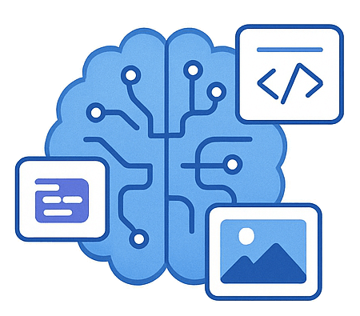

  

# Implement generative AI solutions (15–20%)

This section focuses on building solutions using Azure AI Foundry (Azure AI Studio) and Azure OpenAI Service, including RAG, prompt engineering, fine-tuning, and operationalization.

## Skills & Microsoft Learn Resources

### Build generative AI solutions with Azure AI Studio

*Leveraging the unified Azure AI Studio platform for end-to-end development, evaluation, and deployment of Generative AI applications.*

| Skill / Focus Area | Description / Context | Resources |
| :----------------------------------------------------------------- | :----------------------------------------------------------------------------------------------------------------------------------------------- | :--------------------------------------------------------------------------------------------------------------------------------------------------------------------------------------------------------------------------------------------------------------------------------------------------------------------------------- |
| **Plan and prepare for a generative AI solution** | Initial phase involving defining the use case, gathering requirements, identifying data sources, and considering responsible AI principles. | Learn Module: [Plan and prepare to develop AI solutions on Azure](https://learn.microsoft.com/en-us/training/modules/plan-prepare-ai-solutions/) |
| **Deploy hub, project, resources with Azure AI Studio** | Setting up the necessary Azure AI Hub and Project infrastructure within AI Studio, which organizes resources, models, data, and collaboration. | Learn Path Introduction: [Develop generative AI apps in Azure AI Studio](https://learn.microsoft.com/en-us/training/paths/develop-generative-ai-apps-azure-ai-studio/) (Covers initial setup concepts) |
| **Deploy appropriate generative AI model** | Selecting suitable foundation models (e.g., GPT, Llama) from the Model Catalog within AI Studio and deploying them to endpoints for use. | Learn Module (within path): [Deploy models using Azure AI Studio](https://learn.microsoft.com/en-us/training/modules/deploy-models-azure-ai-studio/) *(Part of the Develop generative AI apps path)* |
| **Implement a prompt flow solution** | Visually designing, building, and testing executable flows that orchestrate LLMs, prompts, Python code, and external tools for complex tasks. | Learn Module (within path): [Orchestrate generative AI workflows with prompt flow in Azure AI Studio](https://learn.microsoft.com/en-us/training/modules/orchestrate-workflows-prompt-flow-azure-ai-studio/) *(Part of the Develop generative AI apps path)* |
| **Implement RAG pattern (grounding in data)** | Connecting deployed models to your organization's specific data sources (via Azure AI Search indexes) to provide relevant, up-to-date context. | Learn Module (within path): [Work with data in Azure AI Studio](https://learn.microsoft.com/en-us/training/modules/work-data-azure-ai-studio/) *(Part of the Develop generative AI apps path, covers data concepts for RAG)*   Docs: [Retrieval-Augmented Generation (RAG) in Azure AI Studio](https://learn.microsoft.com/en-us/azure/ai-studio/concepts/retrieval-augmented-generation) |
| **Evaluate models and flows** | Assessing the performance, quality, safety, and cost-effectiveness of generative models and prompt flows using built-in and custom metrics. | Learn Module (within path): [Evaluate generative AI models using Azure AI Studio](https://learn.microsoft.com/en-us/training/modules/evaluate-generative-ai-models-azure-ai-studio/) *(Part of the Develop generative AI apps path)* |
| **Integrate project into application with Azure AI Studio SDK** | Using the Azure AI SDK (Python) to programmatically interact with AI Studio projects, manage assets, run flows, and integrate into applications. | Learn Module (within path): [Develop generative AI apps using the Azure AI SDK](https://learn.microsoft.com/en-us/training/modules/develop-apps-azure-ai-sdk/) *(Part of the Develop generative AI apps path)* |
| **Utilize prompt templates** | Using reusable prompt structures (e.g., Jinja templates within Prompt Flow) to standardize inputs and improve maintainability. | Docs: [Prompt flow tools - LLM Tool (Includes templating)](https://learn.microsoft.com/en-us/azure/ai-studio/reference/tools/llm#inputs) |

______________________________________________________________________

### Use Azure OpenAI Service to generate content

*Directly interacting with Azure OpenAI models via API/SDK for specific content generation tasks (text, code, images) outside the full AI Studio framework.*

| Skill / Focus Area | Description / Context | Resources |
| :----------------------------------------------------------- | :------------------------------------------------------------------------------------------------------------- | :--------------------------------------------------------------------------------------------------------------------------------------------------------------------------------------------------------------------------------------------------------------------- |
| **Provision an Azure OpenAI Service resource** | Creating the dedicated Azure OpenAI service instance, managing access, and configuring networking/security. | Learn Module (within path): [Get started with Azure OpenAI Service](https://learn.microsoft.com/en-us/training/modules/get-started-azure-openai/) *(Part of Develop AI solutions with Azure OpenAI Service path)* |
| **Select and deploy an Azure OpenAI model** | Choosing specific base models (GPT-3.5-Turbo, GPT-4, Embeddings, DALL-E) and creating deployments within the resource. | Learn Module (within path): [Use Azure OpenAI models](https://learn.microsoft.com/en-us/training/modules/use-azure-openai-models/) *(Part of Develop AI solutions with Azure OpenAI Service path)* |
| **Submit prompts for code/natural language generation** | Interacting with deployed text/code generation models (e.g., GPT series) via REST API, SDK, or the AOAI Studio Playground. | Learn Module (within path): [Generate text and code with Azure OpenAI models](https://learn.microsoft.com/en-us/training/modules/generate-text-code-azure-openai-models/) *(Part of Develop AI solutions with Azure OpenAI Service path)* |
| **Use DALL-E model for image generation** | Leveraging DALL-E models (via API/SDK) deployed within Azure OpenAI to generate novel images from text prompts. | Learn Module (within path): [Generate images with Azure OpenAI Service](https://learn.microsoft.com/en-us/training/modules/generate-images-azure-openai/) *(Part of Develop AI solutions with Azure OpenAI Service path)* |
| **Integrate Azure OpenAI into your own application** | Connecting custom applications (web apps, scripts, etc.) to the Azure OpenAI service using SDKs or REST APIs. | Learn Path Introduction: [Develop AI solutions with Azure OpenAI Service](https://learn.microsoft.com/en-us/training/paths/develop-ai-solutions-azure-openai/) (Covers integration aspects throughout) |
| **Use large multimodal models (e.g., GPT-4 Turbo w/ Vision)** | Utilizing models capable of processing multiple input types, such as text and images simultaneously (GPT-4V). | Docs: [Quickstart: Use GPT-4 Turbo with Vision on your data](https://learn.microsoft.com/en-us/azure/ai-services/openai/concepts/gpt-v-quickstart?tabs=image&pivots=programming-language-python) |
| **Implement an Azure OpenAI Assistant** | Leveraging the Assistants API to build stateful, tool-using AI agents capable of complex, multi-step interactions. | Docs: [How to use Azure OpenAI Assistants](https://learn.microsoft.com/en-us/azure/ai-services/openai/how-to/assistant) |

______________________________________________________________________

### Optimize and operationalize a generative AI solution

*Improving model performance, managing deployments efficiently, applying advanced prompting/customization techniques, and ensuring robust operations.*

| Skill / Focus Area | Description / Context | Resources |
| :------------------------------------------------------------------- | :------------------------------------------------------------------------------------------------------------------------------------------------------ | :------------------------------------------------------------------------------------------------------------------------------------------------------------------------------------------------------------------------------------------------------------------------------------------------------ |
| **Configure parameters for generative behavior** | Tuning parameters like `temperature`, `top_p`, `max_tokens`, `presence_penalty`, `frequency_penalty` to control model output creativity, length, and style. | Docs: [Azure OpenAI Service REST API reference - Completions Create](https://learn.microsoft.com/en-us/azure/ai-services/openai/reference#completionscreate) *(API reference lists parameters)* |
| **Configure model monitoring and diagnostic settings** | Setting up Azure Monitor to track usage (tokens, calls), latency, errors, and configure alerts for deployed models (Azure OpenAI & AI Studio endpoints). | Docs: [Monitoring Azure OpenAI Service](https://learn.microsoft.com/en-us/azure/ai-services/openai/how-to/monitoring)   Docs: [Monitor Azure AI Studio](https://learn.microsoft.com/en-us/azure/ai-studio/how-to/monitor-azure-ai-studio) |
| **Optimize and manage resources for deployment** | Planning for scalability using features like Provisioned Throughput Units (PTU) for guaranteed performance, managing quotas, and optimizing costs. | Docs: [Azure OpenAI Provisioned Throughput Units (PTU)](https://learn.microsoft.com/en-us/azure/ai-services/openai/concepts/provisioned-throughput) |
| **Enable tracing and collect feedback** | Implementing mechanisms (like Application Insights integration in Prompt Flow) to trace execution paths and gather user feedback for evaluation/improvement. | Docs: [Monitor and collect feedback on prompt flows](https://learn.microsoft.com/en-us/azure/ai-studio/how-to/monitor-prompt-flow) |
| **Implement model reflection** | Advanced technique where the LLM critiques or refines its own output based on specific criteria, often implemented via multi-step prompting or agents. | *(Advanced Prompt Engineering Pattern - Conceptual)*   Blog Post Example: [Reflexion: Language Agents with Verbal Reinforcement Learning](https://arxiv.org/abs/2303.11366) *(Research context)* |
| **Deploy solutions using containers** | Packaging applications that *use* Generative AI services into containers for deployment flexibility (Note: Base foundation models are typically not user-containerized). | Docs: [Container support in Azure AI services overview](https://learn.microsoft.com/en-us/azure/ai-services/containers/overview) *(General AI Services context)* |
| **Implement orchestration of multiple generative AI models** | Coordinating multiple LLMs, agents, or tools to solve complex problems, using frameworks like Prompt Flow, Semantic Kernel, LangChain, or Autogen. | Docs: [Prompt flow overview](https://learn.microsoft.com/en-us/azure/ai-studio/concepts/prompt-flow-overview)   Link: [Microsoft Semantic Kernel](https://learn.microsoft.com/en-us/semantic-kernel/overview/) |
| **Apply prompt engineering techniques** | Systematically designing and refining prompts (instructions) to elicit desired, accurate, and safe responses from LLMs (e.g., few-shot, chain-of-thought). | Docs: [Introduction to prompt engineering with Azure OpenAI](https://learn.microsoft.com/en-us/azure/ai-services/openai/concepts/prompt-engineering) |
| **Fine-tune a generative model** | Adapting a base foundation model on a specific dataset to improve performance on niche tasks, learn a specific style, or reduce hallucinations. | Learn Module (within AI Studio path): [Fine-tune models using Azure AI Studio](https://learn.microsoft.com/en-us/training/modules/fine-tune-models-azure-ai-studio/) Docs: [Customize a model with fine-tuning (Azure OpenAI)](https://learn.microsoft.com/en-us/azure/ai-services/openai/how-to/fine-tuning?pivots=azure-portal) |
