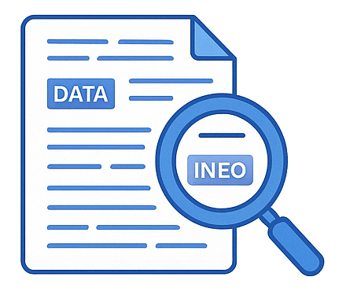

  

# Implement knowledge mining and information extraction solutions (15–20%)

This section covers building search solutions with Azure AI Search, extracting information from documents using Azure AI Document Intelligence, and leveraging Azure AI Content Understanding.

## Skills & Microsoft Learn Resources

### Implement an Azure AI Search solution

*Covers setting up, configuring, populating, and querying an Azure AI Search index, including AI-powered enrichment pipelines (skillsets) and modern search features.*

| Skill / Focus Area | Description / Context | Resources |
| :-------------------------------------------------------- | :--------------------------------------------------------------------------------------------------------------------------------------------------- | :--------------------------------------------------------------------------------------------------------------------------------------------------------------------------------------------------------------------------------------------------------------------- |
| **Provision resource, create index, define skillset** | Initial setup: Creating the search service instance, defining the structure of your searchable data (index), and configuring an AI enrichment pipeline (skillset). | Learn Module: [Create an Azure AI Search solution](https://learn.microsoft.com/en-us/training/modules/create-azure-cognitive-search-solution/) |
| **Create data sources and indexers** | Connecting the search service to your raw data (e.g., Azure Blob Storage, SQL Database) and defining indexers to automate data ingestion and processing. | Learn Module: [Create an Azure AI Search solution](https://learn.microsoft.com/en-us/training/modules/create-azure-cognitive-search-solution/) |
| **Implement custom skills and include in skillset** | Extending the enrichment pipeline with custom processing logic (e.g., calling an Azure Function or custom Web API) to meet specific needs. | Learn Module: [Create a custom skill for Azure AI Search](https://learn.microsoft.com/en-us/training/modules/create-azure-ai-custom-skill/) |
| **Create and run an indexer** | Triggering the indexer process to pull data from the source, apply the skillset (if defined), and populate/update the search index. | Learn Module: [Create an Azure AI Search solution](https://learn.microsoft.com/en-us/training/modules/create-azure-cognitive-search-solution/) |
| **Query an index (syntax, sort, filter, wildcards)** | Retrieving information from the populated index using various query types, filtering, sorting, faceting, and other search techniques. | Learn Module: [Query an Azure AI Search index](https://learn.microsoft.com/en-us/training/modules/query-azure-cognitive-search/) |
| **Manage Knowledge Store projections (file, object, table)** | Persisting the enriched data generated by skillsets into Azure Storage (Blobs, Tables) for analysis, reporting, or use outside the search index. | Learn Module: [Create a knowledge store with Azure AI Search](https://learn.microsoft.com/en-us/training/modules/create-knowledge-store-azure-cognitive-search/) |
| **Implement semantic and vector store solutions** | Enhancing search relevance using deep learning models (Semantic Ranking) and enabling search based on meaning/similarity using embeddings (Vector Search). | Learn Module: [Perform vector search and retrieval in Azure AI Search](https://learn.microsoft.com/en-us/training/modules/improve-search-results-vector-search/) Learn Module: [Perform search reranking with semantic ranking in Azure AI Search](https://learn.microsoft.com/en-us/training/modules/use-semantic-search/) |

______________________________________________________________________

### Implement an Azure AI Document Intelligence solution

*Focuses on using Azure AI Document Intelligence (formerly Form Recognizer) to automate data extraction from various document types.*

| Skill / Focus Area | Description / Context | Resources |
| :------------------------------------------------------ | :-------------------------------------------------------------------------------------------------------------------------------------------------- | :-------------------------------------------------------------------------------------------------------------------------------------------------------------------------------------------------------------------------------- |
| **Provision a Document Intelligence resource** | Creating the Azure AI Document Intelligence service instance in Azure. | Learn Module: [Use prebuilt models in Azure AI Document Intelligence](https://learn.microsoft.com/en-us/training/modules/use-prebuilt-form-recognizer-models/) (Covers provisioning as a first step) |
| **Use prebuilt models to extract data** | Leveraging ready-to-use models optimized for common document types like invoices, receipts, business cards, ID documents, W-2 forms, etc. | Learn Module: [Use prebuilt models in Azure AI Document Intelligence](https://learn.microsoft.com/en-us/training/modules/use-prebuilt-form-recognizer-models/) |
| **Implement a custom document intelligence model** | Training a model tailored to extract specific fields from your unique document layouts (custom forms, industry-specific documents). | Docs: [Custom document models in Document Intelligence](https://learn.microsoft.com/en-us/azure/ai-services/document-intelligence/concept-custom-models?view=doc-intel-4.0.0) |
| **Train, test, publish a custom model** | The iterative process of labeling sample documents, training the model, evaluating its performance, and deploying it for use via API calls. | *(Process primarily managed via Document Intelligence Studio and documented in quickstarts/how-to guides)* Quickstart: [Train a custom model using the Sample Labeling tool](https://learn.microsoft.com/en-us/azure/ai-services/document-intelligence/quickstarts/try-document-intelligence-studio?view=doc-intel-4.0.0) |
| **Create a composed document intelligence model** | Combining multiple individually trained custom models into a single model, allowing classification and extraction across various form types. | Docs: [Composed custom models in Document Intelligence](https://learn.microsoft.com/en-us/azure/ai-services/document-intelligence/concept-composed-models?view=doc-intel-4.0.0) |

______________________________________________________________________

### Extract information with Azure AI Content Understanding

*Applies various AI capabilities (often orchestrated via AI Search skillsets or custom applications) to process and extract insights from multimodal content. **Note:** "Content Understanding" is typically achieved by combining capabilities from services like AI Search, AI Language, AI Vision, and AI Document Intelligence, rather than being a single, distinct Azure service.*

| Skill / Focus Area | Description / Context | Resources |
| :------------------------------------------------------------------------ | :---------------------------------------------------------------------------------------------------------------------- | :--------------------------------------------------------------------------------------------------------------------------------------------------------------------------------------------------------------- |
| **Create OCR pipeline for text extraction** | Setting up processes to extract printed and handwritten text from images or document pages (often using AI Vision/DI or AI Search's OcrSkill). | *(Leverages OCR from Vision, Document Intelligence, or built-in AI Search skills)* Docs: [AI Vision OCR](https://learn.microsoft.com/en-us/azure/ai-services/computer-vision/overview-ocr) |
| **Summarize, classify, detect attributes of documents** | Applying Natural Language Processing (NLP) techniques (often via AI Language skills in an AI Search skillset) to extracted text for summarization, categorization, etc. | *(Leverages AI Language capabilities, often within an AI Search skillset)* Docs: [Built-in skills for text processing (AI Search)](https://learn.microsoft.com/en-us/azure/search/cognitive-search-predefined-skills#utility-skills) |
| **Extract entities, tables, images from documents** | Identifying specific structures like tables, key-value pairs, named entities (people, places), or processing embedded images within documents/content. | *(Leverages AI Language, AI Document Intelligence, or AI Vision capabilities, often within an AI Search skillset)* |
| **Process/ingest documents, images, videos, audio** | Handling diverse content types during ingestion, often managed by AI Search indexers connecting to various sources and potentially using specific skills for analysis. | *(Orchestration via AI Search indexers/skillsets or custom application logic)* Docs: [Index data from Azure Blob Storage (AI Search)](https://learn.microsoft.com/en-us/azure/search/search-howto-indexing-azure-blob-storage) |
