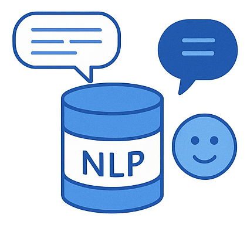

  

# Implement natural language processing solutions (15–20%)

This section covers analyzing and translating text and speech, and building custom language models using Azure AI Language and Azure AI Speech services.

## Skills & Microsoft Learn Resources

### Analyze and translate text (Using Azure AI Language & Translator)

*Focuses on using Azure AI Language for extracting insights from text and Azure AI Translator for language conversion.*

| Skill / Focus Area | Description / Context | Resources |
| :--------------------------------------------------------------- | :----------------------------------------------------------------------------------------------- | :-------------------------------------------------------------------------------------------------------------------------------------------------------------------------- |
| **Extract key phrases and entities** | Identifying the main topics (key phrases) and specific named items (entities like people, places). | Learn Module: [Extract insights from text with the Language service](https://learn.microsoft.com/en-us/training/modules/extract-insights-text-language-service/) |
| **Determine sentiment of text** | Analyzing the emotional tone (positive, negative, neutral) expressed in text data. | Learn Module: [Extract insights from text with the Language service](https://learn.microsoft.com/en-us/training/modules/extract-insights-text-language-service/) |
| **Detect the language used in text** | Identifying the language of a given piece of text, crucial for routing or conditional processing. | Learn Module: [Extract insights from text with the Language service](https://learn.microsoft.com/en-us/training/modules/extract-insights-text-language-service/) |
| **Detect personally identifiable information (PII) in text** | Finding and optionally redacting sensitive data (names, addresses, IDs) for privacy/compliance. | Docs: [What is PII detection in Azure AI Language?](https://learn.microsoft.com/en-us/azure/ai-services/language-service/personally-identifiable-information/overview) |
| **Translate text and documents (Azure AI Translator)** | Converting text or entire documents between a wide range of supported languages. | Learn Module: [Translate text with the Translator service](https://learn.microsoft.com/en-us/training/modules/translate-text-translator-service/) |

______________________________________________________________________

### Process and translate speech (Using Azure AI Speech)

*Covers converting spoken language to text (STT), synthesizing speech from text (TTS), and translating speech in real-time.*

| Skill / Focus Area | Description / Context | Resources |
| :----------------------------------------------------------- | :---------------------------------------------------------------------------------------------------------- | :--------------------------------------------------------------------------------------------------------------------------------------------------------------------------------------------------------------------------------------------------------------------------------------------------------------------------------------------------------------- |
| **Integrate generative AI speaking capabilities** | Utilizing advanced Text-to-Speech (TTS) with highly natural-sounding standard, custom, or personal voices. | *(Leverages TTS capabilities within Azure AI Speech)* Learn Module: [Synthesize speech with Azure AI Speech](https://learn.microsoft.com/en-us/training/modules/synthesize-speech/) Docs: [Personal voice (preview)](https://learn.microsoft.com/en-us/azure/ai-services/speech-service/personal-voice) |
| **Implement text-to-speech (TTS) and speech-to-text (STT)** | Core capabilities for speech synthesis (creating audio from text) and speech recognition (transcribing audio). | Learn Module: [Recognize and synthesize speech with Azure AI Speech](https://learn.microsoft.com/en-us/training/modules/recognize-synthesize-speech/) |
| **Improve TTS using SSML** | Using Speech Synthesis Markup Language (SSML) to gain fine-grained control over TTS output (pitch, rate, pauses, pronunciation). | Learn Module: [Synthesize speech with Azure AI Speech](https://learn.microsoft.com/en-us/training/modules/synthesize-speech/) Docs: [Speech Synthesis Markup Language (SSML) overview](https://learn.microsoft.com/en-us/azure/ai-services/speech-service/speech-synthesis-markup-structure) |
| **Implement custom speech solutions** | Training custom models to improve STT accuracy for specific acoustic environments, vocabulary, or pronunciation (Custom Speech), or creating unique TTS voices (Custom Neural Voice). | Learn Module: [Create custom speech models](https://learn.microsoft.com/en-us/training/modules/create-custom-speech-models/) Docs: [What is Custom Speech?](https://learn.microsoft.com/en-us/azure/ai-services/speech-service/custom-speech-overview) Docs: [What is Custom Neural Voice?](https://learn.microsoft.com/en-us/azure/ai-services/speech-service/custom-neural-voice) |
| **Implement intent and keyword recognition with Speech** | Identifying user intentions or specific keywords directly from spoken input, often combining Speech SDK with a CLU model. | *(Combines Speech SDK with Language Understanding Service)* Learn Module: [Create a conversational language understanding model](https://learn.microsoft.com/en-us/training/modules/create-conversational-language-understanding-model/) (Covers intent model creation) Docs: [What is intent recognition?](https://learn.microsoft.com/en-us/azure/ai-services/speech-service/intent-recognition-overview) |
| **Translate speech-to-speech and speech-to-text** | Performing real-time translation of spoken audio either into text in another language or synthesized speech in another language. | Docs: [What is speech translation?](https://learn.microsoft.com/en-us/azure/ai-services/speech-service/speech-translation) |

______________________________________________________________________

### Implement custom language models (Using Azure AI Language)

*Focuses on building tailored models using Conversational Language Understanding (CLU) for intent/entity recognition and Custom Question Answering for knowledge base bots.*

| Skill / Focus Area | Description / Context | Resources |
| :----------------------------------------------------------- | :--------------------------------------------------------------------------------------------------------- | :--------------------------------------------------------------------------------------------------------------------------------------------------------------------------------------------------------------------------------------- |
| **Create intents, entities, utterances (CLU)** | Defining the structure of a CLU model for understanding user requests in conversational applications. | Learn Module: [Create a conversational language understanding model](https://learn.microsoft.com/en-us/training/modules/create-conversational-language-understanding-model/) |
| **Train, evaluate, deploy, test CLU model** | Following the development lifecycle to build, refine, and publish a functional CLU model. | Learn Module: [Create a conversational language understanding model](https://learn.microsoft.com/en-us/training/modules/create-conversational-language-understanding-model/) |
| **Optimize, backup, recover CLU model** | Managing CLU models via Language Studio or APIs, including performance improvements and lifecycle tasks. | *(Managed through Language Studio: Versioning, Import/Export features)* Docs: [CLU - Import and export project](https://learn.microsoft.com/en-us/azure/ai-services/language-service/conversational-language-understanding/how-to/import-export-project) |
| **Consume a language model from client application** | Integrating the deployed CLU model into applications using the provided SDKs or REST API endpoint. | *(Demonstrated within CLU module/docs via SDK/REST API examples)* |
| **Create a custom question answering project** | Setting up a knowledge base using the Custom Question Answering feature of Azure AI Language. | Learn Module: [Create a question answering solution](https://learn.microsoft.com/en-us/training/modules/create-qna-solution/) |
| **Add question-and-answer pairs & import sources** | Populating the knowledge base manually with QnA pairs or importing from existing documents/URLs. | Learn Module: [Create a question answering solution](https://learn.microsoft.com/en-us/training/modules/create-qna-solution/) |
| **Train, test, publish a knowledge base** | Following the development lifecycle for creating, refining, and deploying a QnA knowledge base. | Learn Module: [Create a question answering solution](https://learn.microsoft.com/en-us/training/modules/create-qna-solution/) |
| **Create a multi-turn conversation** | Enabling follow-up questions and prompts within the QnA service to guide users through a topic. | Learn Module: [Create a question answering solution](https://learn.microsoft.com/en-us/training/modules/create-qna-solution/) (Covers follow-up prompts) |
| **Add alternate phrasing & chit-chat to knowledge base** | Improving the QnA model's robustness by adding synonyms/paraphrases and pre-built small talk capabilities. | Learn Module: [Create a question answering solution](https://learn.microsoft.com/en-us/training/modules/create-qna-solution/) |
| **Export a knowledge base** | Backing up or migrating a QnA project using export features available in Language Studio or via APIs. | *(Managed via Language Studio: Import/Export features)* Docs: [Custom question answering - Migrate a knowledge base](https://learn.microsoft.com/en-us/azure/ai-services/language-service/question-answering/how-to/migrate-qnamaker) |
| **Create multi-language question answering solution** | Configuring a single QnA project to support and respond in multiple languages. | Docs: [Multi-language support in Custom question answering](https://learn.microsoft.com/en-us/azure/ai-services/language-service/question-answering/how-to/language-support) |
| **Implement custom translation (Custom Translator)** | Training specialized translation models using your own parallel documents to improve accuracy for specific terminology/domains. | Docs: [What is Custom Translator?](https://learn.microsoft.com/en-us/azure/ai-services/translator/custom-translator/overview) |
