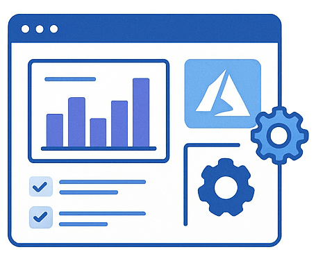

  

# Plan and manage an Azure AI solution (20–25%)

This section covers selecting the right Azure AI services, planning for responsible AI, creating, deploying, managing, monitoring, and securing these services.

## Skills & Microsoft Learn Resources

### Select the appropriate Azure AI services

*Understanding the diverse capabilities of Azure AI services is key to choosing the most effective tools for your specific AI task (e.g., image analysis, text processing, generative AI).*

| Skill / Focus Area | Description / Context | Resources |
| :-------------------------------------------------- | :-------------------------------------------------------------------------------------------------------------------------- | :------------------------------------------------------------------------------------------------------------------------------------------------------------------------------------------------------ |
| **General Overview** | Foundational understanding of the Azure AI portfolio and its components. | Docs: [What are Azure AI Services?](https://learn.microsoft.com/en-us/azure/ai-services/what-are-ai-services) |
| **Select service for Generative AI** | Choosing services for building Generative AI solutions, often involving Azure OpenAI and Azure AI Studio for management. | Learn Module: [Plan and prepare to develop AI solutions on Azure](https://learn.microsoft.com/en-us/training/modules/plan-prepare-ai-solutions/) Learn Path Context: [Develop generative AI apps in Azure AI Studio](https://learn.microsoft.com/en-us/training/paths/develop-generative-ai-apps-azure-ai-studio/) |
| **Select service for Computer Vision** | Choosing services for tasks like image classification, object detection, OCR, and video analysis. | Learn Path: [Create computer vision solutions with Azure AI Vision](https://learn.microsoft.com/en-us/training/paths/create-computer-vision-solutions-azure-ai/) |
| **Select service for Natural Language Processing (NLP)** | Choosing services for understanding and processing text, including sentiment analysis, key phrase extraction, translation. | Learn Path: [Explore natural language processing](https://learn.microsoft.com/en-us/training/paths/explore-natural-language-processing/) |
| **Select service for Speech** | Choosing services for speech-to-text, text-to-speech, speaker recognition, and speech translation. | Learn Module: [Fundamentals of Azure AI Speech](https://learn.microsoft.com/en-us/training/modules/introduction-azure-speech-services/) |
| **Select service for Information Extraction** | Choosing services for extracting structured data from documents (forms, invoices, receipts). | Learn Module: [Fundamentals of Azure AI Document Intelligence](https://learn.microsoft.com/en-us/training/modules/analyze-receipts-form-recognizer/) *(Note: Form Recognizer is now Document Intelligence)* |
| **Select service for Knowledge Mining** | Choosing services for building intelligent search solutions over large, unstructured datasets. | Learn Module: [Fundamentals of Knowledge Mining and Azure AI Search](https://learn.microsoft.com/en-us/training/modules/intro-to-azure-search/) |

______________________________________________________________________

### Plan, create and deploy an Azure AI service

*Covers the practical steps involved in the lifecycle of an Azure AI service, from initial planning and resource provisioning to various deployment strategies.*

| Skill / Focus Area | Description / Context | Resources |
| :----------------------------------------- | :----------------------------------------------------------------------------------------------------------------------------------------------------------- | :---------------------------------------------------------------------------------------------------------------------------------------------------------------------------------------------------------------------------------------------------------------------------------------- |
| **Plan for Responsible AI Principles** | Incorporating Microsoft's Responsible AI principles (Fairness, Reliability & Safety, Privacy & Security, Inclusiveness, Transparency, Accountability) throughout the AI solution design and development lifecycle. | Learn Module: [Implement a responsible generative AI solution in Azure AI Studio](https://learn.microsoft.com/en-us/training/modules/implement-responsible-generative-ai-azure-ai-studio/) Docs: [Responsible AI Overview in Azure AI Services](https://learn.microsoft.com/en-us/azure/ai-services/responsible-ai) |
| **Create an Azure AI resource** | Provisioning Azure AI resources via Portal, CLI, or SDKs. Understanding the difference between single-service and multi-service (Azure AI services) resources. | Docs: [Create an Azure AI Services Resource (Multi-service or Specific)](https://learn.microsoft.com/en-us/azure/ai-services/multi-service-resource?pivots=azportal) |
| **Choose appropriate AI models** | Selecting suitable pre-built models offered by services or custom models, often managed via Azure AI Studio or specific service portals. | Docs: [Model Catalog in Azure AI Studio](https://learn.microsoft.com/en-us/azure/ai-studio/concepts/models-catalog) (Example context for GenAI/ML) |
| **Deploy AI models/services** | Deploying trained models or service functionality using appropriate options (e.g., managed online endpoints, web apps, containers). | *(Deployment varies significantly by service - check specific service docs/modules)* Docs: [Container Support for AI Services](https://learn.microsoft.com/en-us/azure/ai-services/containers/overview) |
| **Install and utilize SDKs/APIs** | Interacting with provisioned Azure AI services programmatically using language-specific SDKs or REST APIs. | Docs: [Azure SDK Releases](https://azure.github.io/azure-sdk/) (Find specific service SDKs) *(Specific API reference docs are crucial per service)* |
| **Determine a default endpoint** | Identifying the specific endpoint URL required to access a deployed Azure AI service instance. | Docs: [Finding Service Endpoints & Keys](https://learn.microsoft.com/en-us/azure/ai-services/authentication?tabs=powershell#view-information-about-your-resource) |
| **Integrate into CI/CD pipeline** | Automating the build, testing, and deployment process for AI solutions using tools like Azure DevOps or GitHub Actions. | *(General Azure DevOps / GitHub Actions concepts apply)* Docs: [Azure Pipelines Overview](https://learn.microsoft.com/en-us/azure/devops/pipelines/?view=azure-devops) |
| **Plan and implement container deployment**| Deploying Azure AI services within Docker containers for portability, environment consistency, and edge scenarios. | Docs: [Container Deployment for AI Services Overview](https://learn.microsoft.com/en-us/azure/ai-services/containers/overview) |

______________________________________________________________________

### Manage, monitor, and secure an Azure AI service

*Focuses on the essential operational aspects after deployment, including performance tracking, cost optimization, and robust security measures.*

| Skill / Focus Area | Description / Context | Resources |
| :----------------------------------- | :-------------------------------------------------------------------------------------------------------------------------------- | :----------------------------------------------------------------------------------------------------------------------------------------------------------------------------------------------------------------------------------------------------------------------------------------------- |
| **Monitor an Azure AI resource** | Tracking usage metrics (calls, latency), performance, failures, and overall health using Azure Monitor (Metrics, Logs, Alerts). | Docs: [Monitor Azure AI services](https://learn.microsoft.com/en-us/azure/ai-services/monitor-ai-services) |
| **Manage costs** | Planning budgets, understanding pricing tiers (e.g., Free, Standard, Commitment), monitoring spending, and implementing cost-saving strategies. | Docs: [Plan and manage costs for Azure AI services](https://learn.microsoft.com/en-us/azure/ai-services/plan-manage-costs) |
| **Manage and protect account keys** | Securing access credentials (API keys) using best practices like regular rotation, restricting access, and leveraging Azure Key Vault. | Docs: [Managing Account Keys (part of resource management)](https://learn.microsoft.com/en-us/azure/ai-services/manage-resources?tabs=windows#get-the-keys-for-your-resource) Docs: [Azure Key Vault Overview](https://learn.microsoft.com/en-us/azure/key-vault/general/overview) |
| **Manage authentication** | Configuring secure access methods beyond keys, including Azure Active Directory (Azure AD) authentication and Managed Identities for Azure resources. | Docs: [Authentication Options (Keys, Azure AD, Managed Identity)](https://learn.microsoft.com/en-us/azure/ai-services/authentication?tabs=powershell) |
| **Configure network security** | Implementing network isolation and security using features like Virtual Networks (VNet) service endpoints and Private Endpoints. | Docs: [Configure Azure AI services virtual networks](https://learn.microsoft.com/en-us/azure/ai-services/cognitive-services-virtual-networks?tabs=portal) |
| **Configure diagnostic logging** | Enabling detailed logging for troubleshooting, auditing, and deeper monitoring insights using Azure Monitor Logs (Log Analytics). | Docs: [Enable diagnostic logging for Azure AI services](https://learn.microsoft.com/en-us/azure/ai-services/diagnostic-logging) |

______________________________________________________________________

### Implement AI solutions responsibly

*Ensuring AI solutions are developed and deployed ethically and safely by implementing safeguards, content moderation, and adhering to Microsoft's Responsible AI principles.*

| Skill / Focus Area | Description / Context | Resources |
| :------------------------------------------------------ | :------------------------------------------------------------------------------------------------------------------------------------------ | :------------------------------------------------------------------------------------------------------------------------------------------------------------------------------------------------------------------------------------- |
| **Implement content moderation solutions** | Utilizing services like Azure AI Content Safety to detect potentially harmful or unwanted content (text, images). | Docs: [Azure AI Content Safety Service](https://learn.microsoft.com/en-us/azure/ai-services/content-safety/overview) |
| **Configure responsible AI insights & content safety** | Setting up monitoring, dashboards (like RAI dashboards in Azure Machine Learning), and safety controls within services (e.g., Azure OpenAI). | Learn Module: [Implement a responsible generative AI solution in Azure AI Studio](https://learn.microsoft.com/en-us/training/modules/implement-responsible-generative-ai-azure-ai-studio/) *(Focuses on GenAI context)* |
| **Implement content filters and blocklists** | Customizing safety settings and filters, particularly within services like Azure OpenAI, to align with specific application requirements. | Docs: [Azure OpenAI Content Filtering](https://learn.microsoft.com/en-us/azure/ai-services/openai/concepts/content-filter) |
| **Prevent harmful behavior (prompt shields, detection)**| Implementing advanced safety features like prompt injection detection (prompt shields) and specific harm category detection (jailbreak etc.). | Docs: [Content Safety Concepts (includes Prompt Shields)](https://learn.microsoft.com/en-us/azure/ai-studio/concepts/content-safety#prompt-shields-preview) |
| **Design a responsible AI governance framework** | Establishing organizational policies, role-based access control (RBAC), and controls (Azure Policy) for consistent RAI application. | *(Conceptual - Combines Azure Policy, RBAC, Service Features)* Docs: [Azure Cloud Adoption Framework - Govern](https://learn.microsoft.com/en-us/azure/cloud-adoption-framework/govern/) Docs: [What is Azure Policy?](https://learn.microsoft.com/en-us/azure/governance/policy/overview) |
